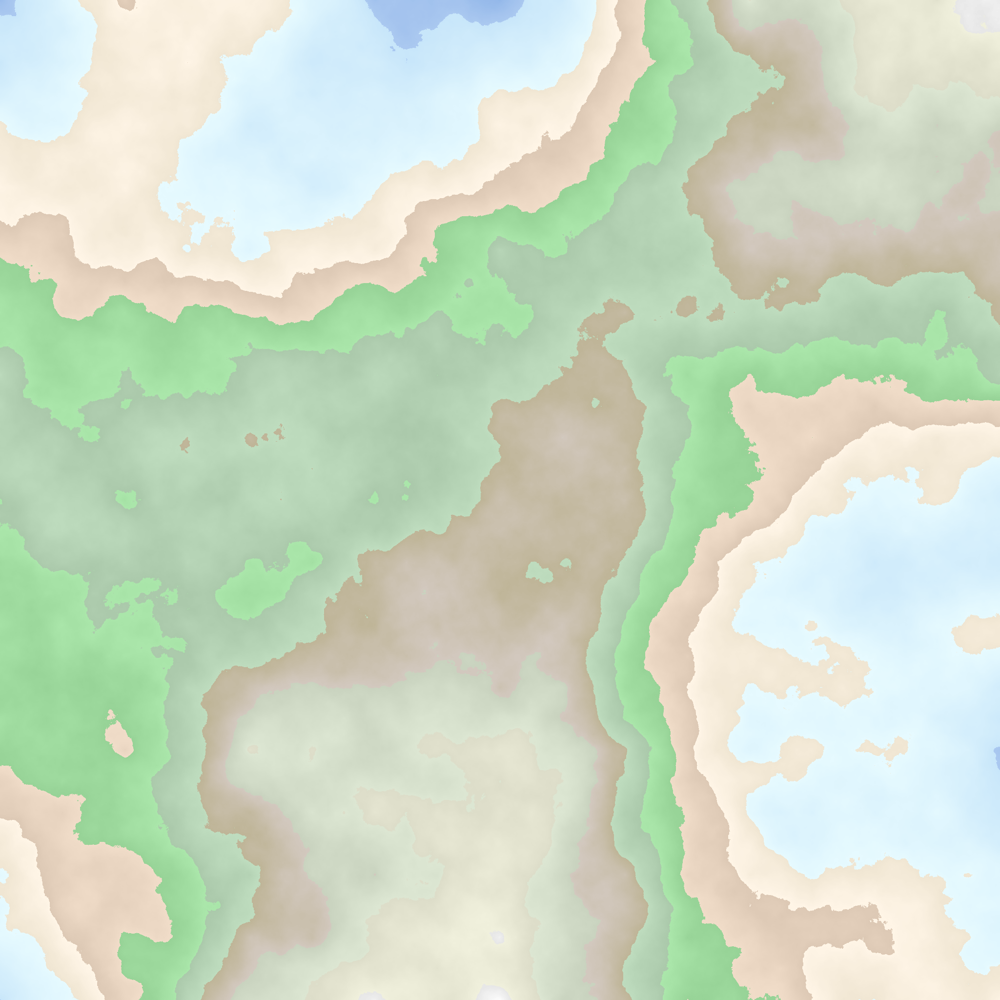
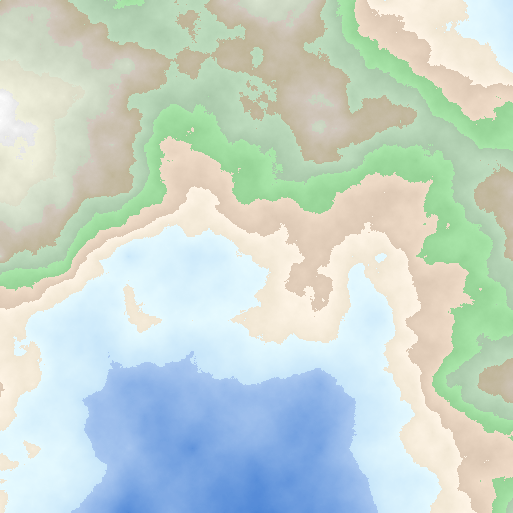
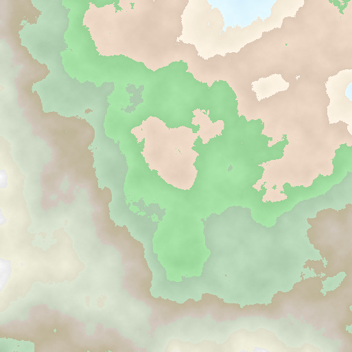

# Fractal Generator Golang

This project generates beautiful fractal maps using the Diamond-Square algorithm. The generated maps can represent different types of terrains, such as mountains, plains, and water bodies.

---

## Examples

Here are some examples of generated fractal maps:

### Example 1: Mixed Terrain


---

### Example 2: Sea and Islands


---

### Example 3: Mountainous Terrain


---

## How to Use

1. Clone the repository:
   ```bash
   git clone https://github.com/your-repo-name/fractal-generator.git
2. Create a .env file in the root directory with the following content:

```FRACTAL_N=8
FRACTAL_K=0.5
RENDER_VIEW_ANGLE=100.0
RENDER_LIGHT_ANGLE=45.0
OUTPUT_FILE=fractal.png
```

_FRACTAL_N: Size of the map (2^N + 1).
FRACTAL_K: Roughness factor.
RENDER_VIEW_ANGLE: Viewing angle for perspective rendering.
RENDER_LIGHT_ANGLE: Light source angle for shadows.
OUTPUT_FILE: Name of the output file._

3. Build and run the application:

```go build
./fractal-generator
```

The generated fractal will be saved as a .png file in the root directory.